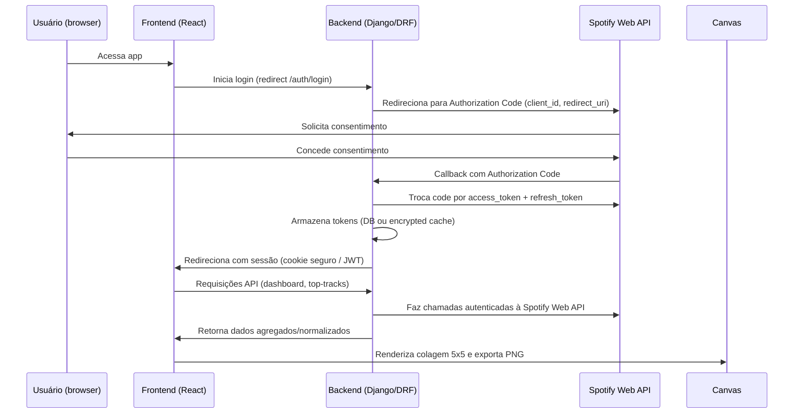

# SpotifyCharts — Arquitetura e Fluxo

## Resumo
Documento descreve a arquitetura proposta (React + Tailwind frontend; Django + DRF backend), o fluxo de autenticação com Spotify, organização de pastas, padrões e dependências recomendadas.

## Stack
- Frontend: React 18, Vite (ou CRA), Tailwind CSS, Axios, React Query (data fetching), Canvas API
- Backend: Python 3.11, Django, Django REST Framework, django-cors-headers, gunicorn, PostgreSQL (opcional para cache)
- Infra: Docker, docker-compose

## Visão de alto nível (sequência)
Mermaid diagram (fluxo):

## Organização de pastas (proposta)
- frontend/
  - public/
  - src/
    - app/ (entry + routes)
    - pages/ (Dashboard, AuthCallback, Collage)
    - components/ (UI pequenos)
    - features/ (domain feature folders)
    - hooks/ (custom hooks)
    - services/ (API clients, canvas helpers)
    - styles/ (tailwind config)
    - utils/
- backend/
  - config/ (settings)
  - apps/
    - accounts/ (models, auth, tokens)
    - charts/ (logic de inferência de álbuns, cache)
    - api/ (serializers, viewsets)
  - requirements.txt
  - manage.py
- infra/
  - docker-compose.yml
  - .env.example

## Padrões e Convenções
- Frontend
  - Hooks: `useAuth()`, `useSpotifyQuery()` (React Query wrappers)
  - Services: centralizar chamadas em `services/spotify.ts` usando Axios instanciado com baseURL apontando ao backend
  - Controllers: componentes containers em `pages/` que orquestram hooks e services
  - UI: componentes puros em `components/` (sem side-effects)
  - State: local para UI; React Query para cache de dados; contexto mínimo apenas para sessão

- Backend
  - Views: usar ViewSets do DRF quando possível; rotas REST bem definidas
  - Services: lógica de integração com Spotify isolada em `services/spotify_client.py`
  - Controllers: ViewSets / APIViews apenas orquestram validações e chamam serviços
  - Tokens: persistir `refresh_token` encriptado; access_token mantido em cache com expiration

## Bibliotecas recomendadas
- Frontend: axios, react-query, react-router, tailwindcss, clsx, uuid, react-use, jest/@testing-library
- Backend: djangorestframework, django-cors-headers, psycopg2-binary, python-dotenv, requests, django-environ

## Estrutura do Banco (proposta)
Recomenda-se usar PostgreSQL para persistência mínima de sessão/cache. Esquema sugerido (Django models):

- UserProfile
  - id (pk)
  - spotify_id (unique)
  - display_name
  - email
  - access_token (encrypted or not stored long-term)
  - refresh_token (encrypted)
  - token_expires_at (datetime)
  - scopes (text)
  - last_sync (datetime)

- CachedTopItems
  - id
  - user (FK -> UserProfile)
  - period (short|medium|long|custom)
  - type (tracks|artists|albums)
  - payload (jsonb)
  - fetched_at

Índice: `user, period, type` para consultas rápidas.

## Endpoints REST (exemplos)
- POST /api/auth/login/ -> inicia redirect OAuth (backend returns redirect URL)
- GET /api/auth/callback/ -> troca code por token, cria/atualiza UserProfile
- GET /api/me/ -> retorna perfil do usuário
- GET /api/top/tracks/?period=short -> retorna lista top tracks
- GET /api/top/albums/?period=short -> retorna albums inferidos
- POST /api/collage/ -> (opcional) endpoint que recebe lista de image URLs e retorna PNG (pode ser gerado no cliente)

## Fluxo OAuth (Authorization Code)
- Backend faz troca de code por tokens e armazena `refresh_token`
- Backend renova `access_token` usando `refresh_token` quando necessário
- Frontend nunca armazena `refresh_token`; apenas recebe sessão do backend

## Observações Operacionais
- Rate limits da Spotify: cachear respostas e implementar backoff
- Rotas CORS: habilitar apenas domínios permitidos
- Segurança: usar HTTPS, cookies `HttpOnly, Secure, SameSite=strict` para sessão

## Próximos passos (curto prazo)
1. Criar scaffold de `backend/` e `frontend/` com Dockerfiles (feito aqui)
2. Implementar rota de OAuth básica e teste de troca de token
3. Implementar endpoint `/api/top/tracks/` e cache simples
4. Implementar UI de login + dashboard básico

---
(Documento gerado automaticamente — adapte ao time e normas internas.)
