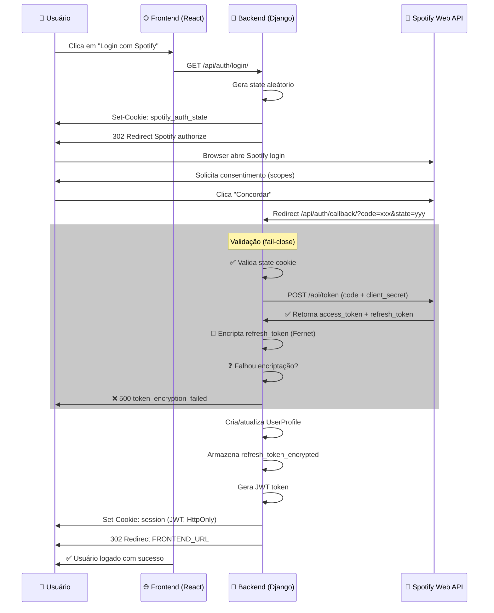
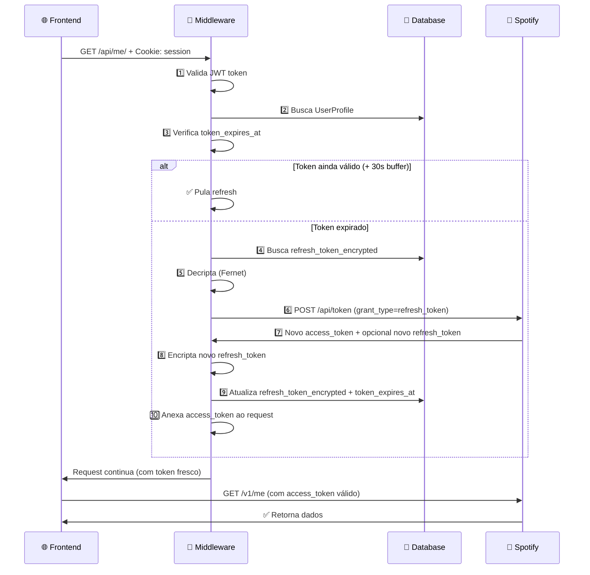
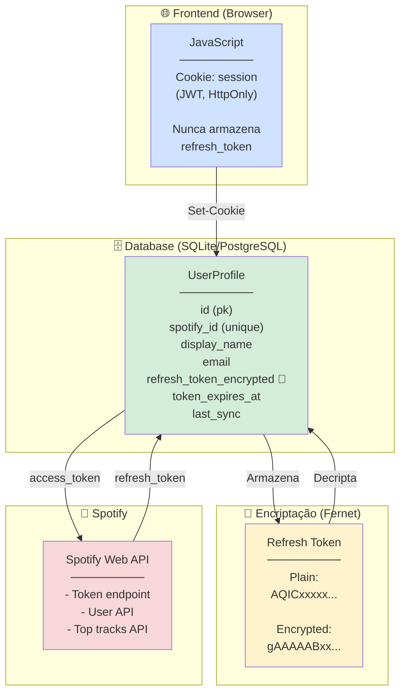
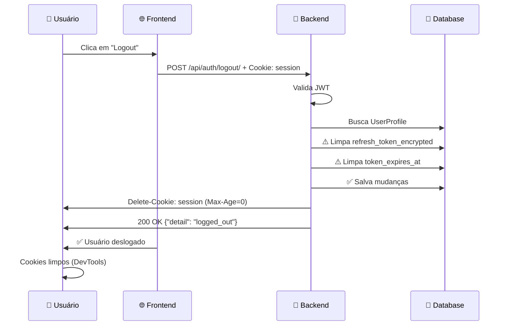
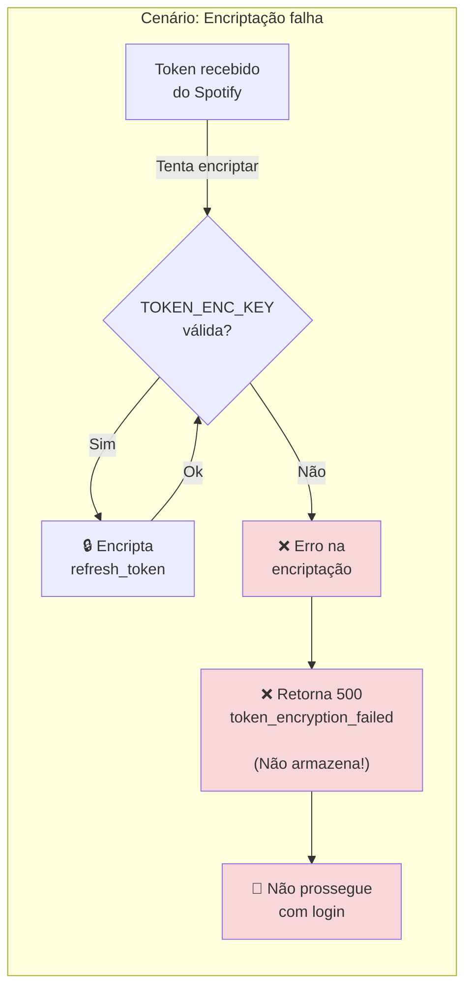
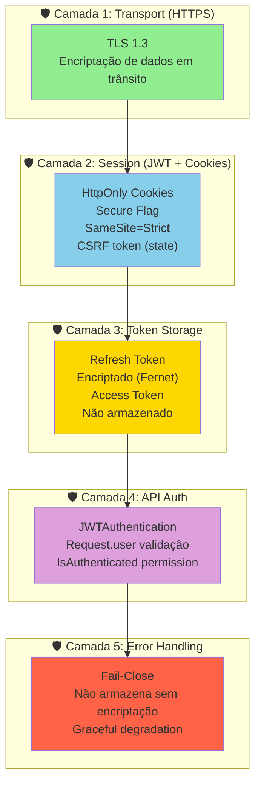
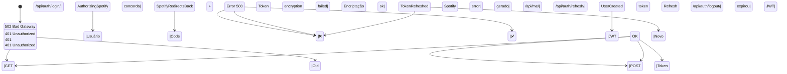

# Diagramas do Fluxo OAuth + Token Management

## 1. Fluxo de Autorização (Authorization Code)



---

## 2. Auto-Refresh de Access Token (Middleware)



---

## 3. Estrutura de Dados & Encriptação



---

## 4. Fluxo de Logout



---

## 5. Validação de Segurança (Fail-Close)



---

## 6. Camadas de Segurança (Defense in Depth)



---

## 7. Estados do Usuário (State Machine)



---

## 8. Fluxo de Teste E2E (Quick Reference)

```mermaid
graph LR
    T1["1️⃣ Login"]
    T2["2️⃣ Verificar<br/>/api/me/"]
    T3["3️⃣ Auto-refresh<br/>(simular expiração)"]
    T4["4️⃣ Refresh manual"]
    T5["5️⃣ Logout"]
    
    T1 -->|✅| T2
    T2 -->|✅| T3
    T3 -->|✅| T4
    T4 -->|✅| T5
    T5 -->|✅ FIM|
    
    T1 -.->|❌| FAIL["Troubleshoot:<br/>- Spotify credentials<br/>- .env vars<br/>- TOKEN_ENC_KEY"]
    
    style T1 fill:#d4edda
    style T2 fill:#d4edda
    style T3 fill:#d4edda
    style T4 fill:#d4edda
    style T5 fill:#d4edda
    style FAIL fill:#f8d7da
```

---

## Resumo Visual

| Aspecto | Status | Detalhes |
|---------|--------|----------|
| **Authorization Code** | ✅ | State param, code exchange no backend |
| **Qualquer usuário** | ✅ | `update_or_create` sem whitelist |
| **Token Storage** | ✅ | Refresh encriptado, access com TTL |
| **Auto-Refresh** | ✅ | Middleware + 30s buffer |
| **Segurança** | ✅ | HTTPS, HttpOnly cookies, fail-close |
| **Testes** | 📖 | Ver [TESTING_OAUTH_FLOW.md](TESTING_OAUTH_FLOW.md) |

